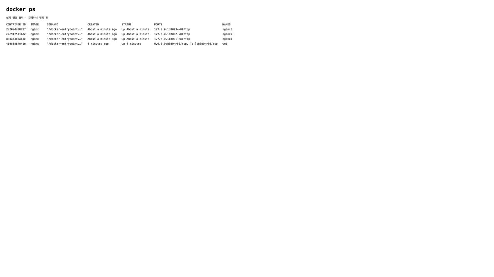

# 5주차- Docker
- [x] `docker --version` 정상 출력
- [x] `docker run hello-world` 실행
- [x] `web`이라는 이름으로 nginx 컨테이너 실행
- [x] 브라우저 또는 `curl`로 `http://localhost:8080` 응답 확인
- [x] `docker ps`에서 실행 상태를 확인
- [x] 실습 결과를 `week05/README.md`에 기록
- [x] 수업에서 만든 컨테이너 정리
- [x] 혼자서 해보기 완료

### 1. 컨테이너 실행

```bash
docker run -d --name nginx1 -p 127.0.0.1:8091:80 nginx
docker run -d --name nginx2 -p 127.0.0.1:8092:80 nginx
docker run -d --name nginx3 -p 127.0.0.1:8093:80 nginx
```

### 2. docker exec로 index.html 수정

```bash
docker exec nginx1 sh -c "sed -i 's/Welcome to nginx!/Welcome to nginx1!/g' /usr/share/nginx/html/index.html"
docker exec nginx2 sh -c "sed -i 's/Welcome to nginx!/Welcome to nginx2!/g' /usr/share/nginx/html/index.html"
docker exec nginx3 sh -c "sed -i 's/Welcome to nginx!/Welcome to nginx3!/g' /usr/share/nginx/html/index.html"
```

### 3. 브라우저 및 curl 확인

세 페이지 모두 정상 응답을 확인했다.

#### nginx1 — http://localhost:8091


```bash
curl http://localhost:8091
```

#### nginx2 — http://localhost:8092


```bash
curl http://localhost:8092
```

#### nginx3 — http://localhost:8093


```bash
curl http://localhost:8093
```

### 4. 실행 중인 컨테이너 확인

```bash
docker ps
```

```text
CONTAINER ID   IMAGE     COMMAND                  CREATED              STATUS              PORTS                                     NAMES
2c20edd38727   nginx     "/docker-entrypoint.…"   About a minute ago   Up About a minute   127.0.0.1:8093->80/tcp                    nginx3
e7e94f5114dc   nginx     "/docker-entrypoint.…"   About a minute ago   Up About a minute   127.0.0.1:8092->80/tcp                    nginx2
89bac3d6ac4c   nginx     "/docker-entrypoint.…"   About a minute ago   Up About a minute   127.0.0.1:8091->80/tcp                    nginx1
4b988884e41e   nginx     "/docker-entrypoint.…"   4 minutes ago        Up 4 minutes        0.0.0.0:8080->80/tcp, [::]:8080->80/tcp   web
```



캡처는 실제 docker ps 출력을 브라우저에 표시한 화면이다. 원본 출력: [docker-ps-multi.txt](docker-ps-multi.txt).

### 5. 실습 후 정리

```bash
docker stop nginx1 nginx2 nginx3 web
docker rm nginx1 nginx2 nginx3 web
docker ps -a
```

정리 후 확인 결과:

```text
CONTAINER ID   IMAGE     COMMAND   CREATED   STATUS    PORTS     NAMES
```

실습 컨테이너 4개를 삭제했다. 컨테이너 정리 후에는 해당 localhost 페이지에 접속되지 않는다.
